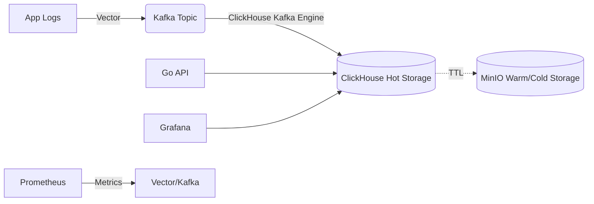

# 🔍 Log Platform — Distributed Log Aggregation & Search System


Production-grade distributed log aggregation and search system built for high throughput (100K+ logs/sec) and sub-second querying, leveraging ClickHouse for storage and analytics.

## Architecture



## Tech Stack
| Component | Technology | Why we chose it |
| --- | --- | --- |
| **Log Collector** | Vector | 10x faster than Logstash, minimal memory footprint, Rust-based. |
| **Message Broker** | Kafka 4.x (KRaft) | Proven scale, eliminates ZooKeeper, true Apache 2.0 license. |
| **Database** | ClickHouse | 10-100x faster analytical queries than Elasticsearch, extremely high compression ratio. |
| **Object Storage** | MinIO | S3-compatible, horizontally scalable, ideal for tiered log storage. |
| **Query API** | Go 1.23 | Fast, concurrent, excellent ClickHouse driver support. |
| **Dashboards** | Grafana | Industry standard, powerful ClickHouse data source. |
| **Orchestration** | Kubernetes | Highly available deployments using operators. |

## Features
- [x] Ingestion at 100K+ logs/sec.
- [x] Sub-second search and aggregation.
- [x] SQL-compatible querying interface.
- [x] Automatic hot-warm-cold storage tiering.
- [x] Full GitOps deployment model.
- [x] Prometheus/Grafana observability.

## Quick Start (Docker Compose)
```bash
make compose-up
make generate-logs
make db-shell
```

## Quick Start (Kubernetes)
```bash
make cluster-create
make deploy-kafka
make deploy-clickhouse
make deploy-vector
make deploy-all
```

## API Reference

**Search Logs**
```bash
curl -X POST http://localhost:8080/api/v1/search \
  -H "Content-Type: application/json" \
  -d '{"query": "level = '\''ERROR'\''", "limit": 100}'
```

**Ingest Log (Manual)**
```bash
curl -X POST http://localhost:8080/api/v1/ingest \
  -H "Content-Type: application/json" \
  -d '{"service": "auth", "level": "INFO", "message": "User logged in"}'
```

## Dashboard Screenshots
*(Insert Image Here)*
- **Overview Dashboard:** Shows ingestion rate, query latency, error rates, and system resource utilization.
- **Log Explorer:** A specialized view mimicking Kibana's discover tab for seamless log searching.

## Configuration Reference
| Variable | Description | Default |
| --- | --- | --- |
| `CLICKHOUSE_ADDR` | ClickHouse host and port | `localhost:9000` |
| `KAFKA_BROKERS` | Comma-separated list of brokers | `localhost:9092` |
| `API_PORT` | Port for the Query API | `8080` |
| `LOG_LEVEL` | Log level for the API | `info` |

## Storage Tiers
We utilize a three-tier architecture to balance performance and costs:
- **Hot Tier:** ClickHouse local SSDs (last 7 days).
- **Warm Tier:** MinIO (S3) for fast retrieval of older data (8 to 90 days).
- **Cold Tier:** MinIO (S3) or Glacier for long-term retention (>90 days).

## Performance Benchmarks
| Metric | Target |
| --- | --- |
| Ingestion Throughput | > 100,000 logs/sec |
| Query Latency (1h range) | < 500 ms |
| Query Latency (24h range) | < 1 second |
| Storage Compression | ~10x |

## Project Structure
```text
.
├── api/             # Go API source code
├── build/           # Dockerfiles
├── cmd/             # Main applications
├── deployments/     # Kubernetes manifests
├── docs/            # Architecture and ops docs
├── internal/        # Private Go code
├── pkg/             # Public Go packages
└── scripts/         # Helper scripts
```

## Contributing
Please see `CONTRIBUTING.md` for guidelines. We use PRs and require all tests to pass in CI.

## License
Licensed under the Apache License, Version 2.0. See [LICENSE](LICENSE) for the full text.
