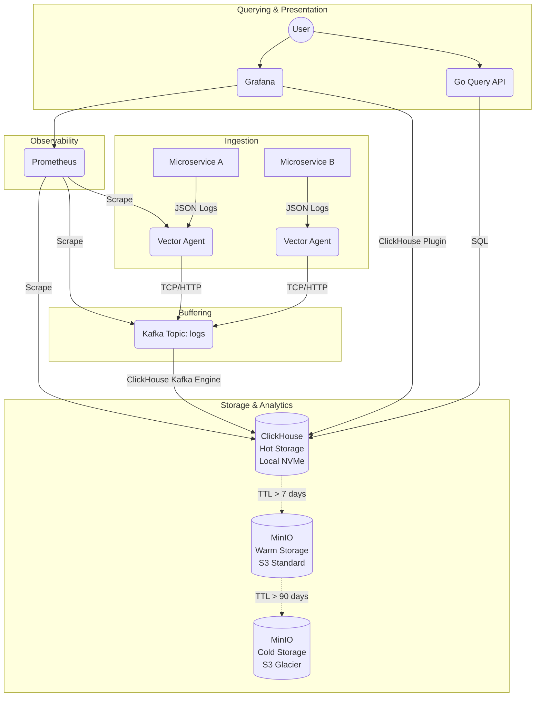
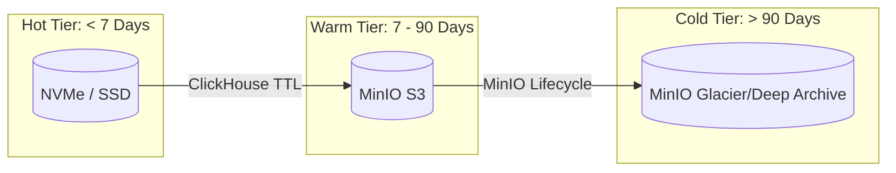

# System Architecture

## System Overview

The Distributed Log Aggregation & Search System is designed to handle 100K+ logs per second with sub-second query latencies. The architecture separates ingestion, buffering, storage, and querying to ensure high availability and scalability.

## Component Details

### 1. Vector (Log Collector & Processor)
- **What**: High-performance, Rust-based observability pipeline.
- **Why**: Handles backpressure gracefully, transforms logs using VRL (Vector Remap Language), and requires minimal CPU/memory.
- **Configuration**: Deployed as a DaemonSet to collect node and container logs, and as an Aggregator to receive logs from internal apps.

### 2. Kafka (Message Broker)
- **What**: Apache Kafka 4.x running in KRaft mode.
- **Why**: Decouples ingestion from storage. If ClickHouse is down for maintenance, Kafka buffers the logs. KRaft removes the ZooKeeper dependency, simplifying operations.
- **Configuration**: Partitioned by service or tenant to ensure ordering and maximize consumer throughput.

### 3. ClickHouse (Database & Analytics Engine)
- **What**: Columnar database management system (RDBMS) for online analytical processing (OLAP).
- **Why**: Incredible aggregation speed and up to 10x compression on log data. Uses the `Kafka` table engine to natively consume from Kafka without a separate consumer service.
- **Configuration**: Replicated tables across availability zones. Data is physically stored in `MergeTree` tables partitioned by date.

### 4. MinIO (Object Storage)
- **What**: S3-compatible, distributed object storage.
- **Why**: Tiered storage is essential for cost management. Retaining months of logs on NVMe drives is expensive. MinIO serves as the backend for ClickHouse's tiered storage.
- **Configuration**: Deployed as a scalable cluster backing ClickHouse `S3` disks.

### 5. Go Query API
- **What**: REST/gRPC API built in Go 1.23.
- **Why**: Provides a secure, controlled interface for developers to query logs without exposing ClickHouse directly. Go's concurrency is perfect for multiplexing queries.
- **Configuration**: Stateless, deployed as an auto-scaling K8s Deployment.

## Data Flow

1. **Generation**: Applications output logs in JSON format to stdout/stderr.
2. **Collection**: Vector agents tail the container logs, enrich them with Kubernetes metadata (namespace, pod), and forward them to Kafka.
3. **Buffering**: Kafka receives the logs in the `logs` topic. It stores them on disk for up to 24 hours.
4. **Ingestion**: ClickHouse's Kafka Engine consumer reads from the topic and inserts batches into a Materialized View, which ultimately writes to a `ReplicatedMergeTree` table.
5. **Tiering**: Background processes in ClickHouse move data older than 7 days to MinIO.
6. **Querying**: Users request logs via the Go API or Grafana. The query engine automatically resolves whether the data is in the hot or warm tier.

## Storage Architecture

- **Hot**: Optimized for speed. Recent logs are queried frequently.
- **Warm**: Optimized for capacity. Still queryable via ClickHouse but at a higher latency.
- **Cold**: Optimized for compliance. Requires restoration before querying.

## Scaling Considerations
- **Kafka**: Add brokers and increase topic partitions.
- **ClickHouse**: Add shards for write throughput, add replicas for read throughput.
- **Go API**: Horizontal Pod Autoscaling (HPA) based on CPU/Request rate.

## Security Model
- All internal communication is TLS encrypted.
- Kafka uses SASL/SCRAM authentication.
- ClickHouse uses RBAC, with the API service having limited read-only permissions on log tables.
- API endpoints require JWT authentication.

## Failure Modes and Recovery
- **Vector dies**: Kubernetes restarts it; log files act as a local buffer.
- **Kafka broker dies**: Replicas take over. ClickHouse pauses consumption until the partition leader is re-elected.
- **ClickHouse node dies**: Kafka buffers incoming logs. Queries are routed to remaining ClickHouse replicas. Once recovered, the node syncs missing data from replicas and resumes Kafka consumption.
